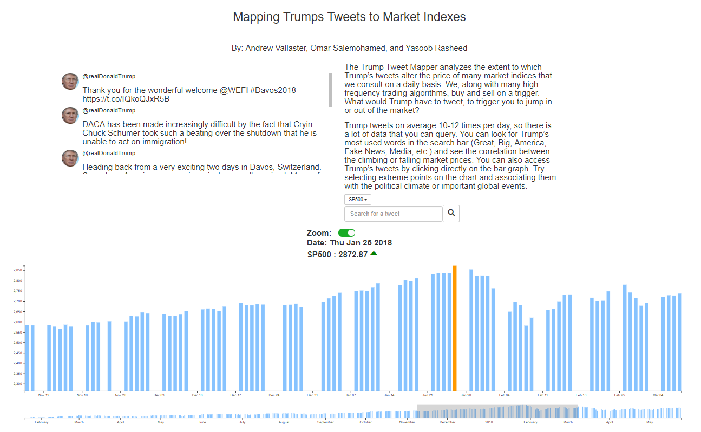

#### Research Intent

We aimed to answer a series of questions related to Trump’s impact on market indexes. Firstly, is there a
noticeable trend regarding how market prices have changed since Trump took office, and if so, how have they
changed? Also, can variations in prices be clearly attributed to the subject/nature of Trump’s tweets? Finally, do
markets respond differently to Trump’s tweets, and if so, which ones seem to be the most receptive?

#### How our Visualization Works

* Search for tweets to find the associated prices for a given index on the days the tweets were made. This
feature is important for gauging what ‘kind’ of Trump tweets, based on vocabulary, affects the market. I.e a
search for ‘taxes’ can allow one to answer the question, ‘Do Trump’s tax related tweets have a noticeable
impact on certain indexes?’

* Select an index to allow one to see what types of indexes are impacted (if impacted) by certain kinds of
tweets, and to estimate which indexes are generally more volatile and responsive to Trump’s tweets.

* Zoom/brush over the market graph. This makes it easier to mouseover a given day in the market and,
therefore, to find the tweets from that day and get a better understanding of the tweets made and changes in
market prices in a smaller interval of time.

* Hover over bars to find corresponding tweets from that day as well as the market prices for that day. Our
facilitation for ‘details on demand’ allows one to easily select an extreme and see what Trump tweeted on that
day.

### Setup

    npm install
    npm run start
    open browser to localhost:3003

